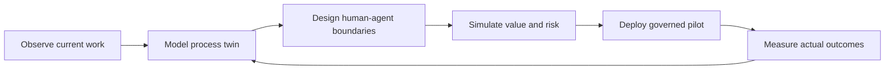
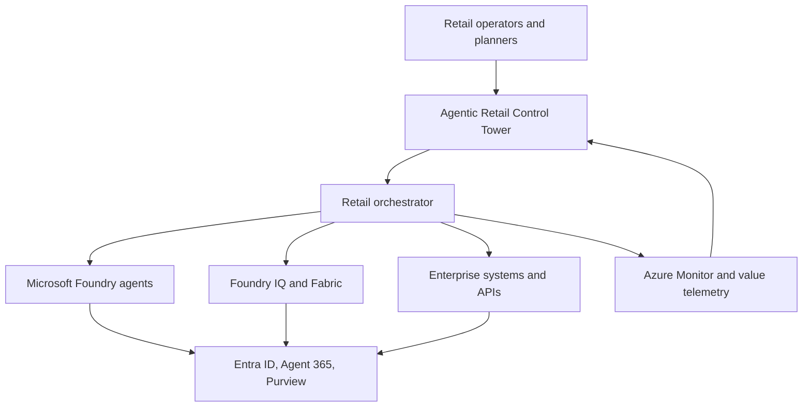

# Agentic Retail Operations Control Tower

**Sense demand, rebalance inventory, and govern execution across every retail channel.**

Agentic Retail Operations is a static browser prototype of a retail control tower. It uses illustrative data and scripted animations. The proposed production design includes specialist agents, A2A interoperability, model routing, independent challenge, and deterministic authorization; these services are not connected or implemented here.

The platform addresses system-level questions that isolated retail copilots cannot:

- How should demand, inventory, allocation, risk, value, and execution agents collaborate?
- Which model is appropriate for forecasting, retrieval, reasoning, evaluation, or calculation?
- Which decisions may execute autonomously and which require accountable approval?
- How can a retailer simulate operational, margin, and customer impact before acting?
- How does the organization prove that agent decisions produced measurable value?

## Live product experience

The interactive MVP demonstrates two enterprise retail events:

1. **Inventory disruption** across stores, distribution centers, and digital channels
2. **Promotion event optimization** across merchandising, supply, and fulfillment

For each event, the UI displays sample evidence, proposed agent responsibilities, operating-model comparisons, and illustrative outcomes. The animation does not invoke agents, evaluate policies, collect approvals, or execute actions.

## Transformation loop



## Architecture

The checked-in MVP runs entirely in the browser so reviewers can explore it without credentials or model costs. The production architecture extends the same experience with Microsoft cloud services.



### Microsoft platform mapping

| Capability | Production service |
|---|---|
| Employee and operations experience | Microsoft 365 / custom web experience |
| Agent reasoning and orchestration | Microsoft Foundry |
| Business knowledge and grounding | Foundry IQ and Microsoft Fabric |
| Identity and delegated authority | Microsoft Entra ID |
| Agent lifecycle and control | Microsoft Agent 365 |
| Data governance | Microsoft Purview |
| Integration tools | Azure Functions / API Management |
| State and evidence | Azure Cosmos DB / Blob Storage |
| Evaluation and operations | Azure Monitor / Application Insights |

## Principal architecture decisions

1. **Model the operating system, not an isolated agent.** The unit of design is the end-to-end business process across people, agents, systems, data, and controls.
2. **Separate evidence preparation from decision authority.** Automating research must not silently expand an agent's authorization.
3. **Use least agency.** Each agent receives the minimum tools, data, duration, and autonomy needed to complete its responsibility.
4. **Make decisions traceable.** Requirements, constraints, evidence, decisions, controls, and acceptance measures remain connected.
5. **Measure business value with model quality.** Adoption, cycle time, unit cost, exception rate, and control compliance matter alongside evaluation scores.

More detail is available in [`docs/architecture.md`](docs/architecture.md), [`docs/threat-model.md`](docs/threat-model.md), and [`docs/production-readiness.md`](docs/production-readiness.md).

## Run locally

Node.js 22 and Python 3 are sufficient; no package installation or cloud account is required. The build copies only five public assets into `dist/`.

```bash
npm start
```

Open `http://localhost:4173`.

Run all tests:

```bash
npm test
```

## Deploy to Azure

The repository contains a Bicep template for an Azure Static Web App and a GitHub Actions workflow.

```bash
az group create --name rg-agentic-retail-ops --location eastus2
az deployment group create \
  --resource-group rg-agentic-retail-ops \
  --template-file infra/main.bicep
```

After creating the Static Web App, add its deployment token to the GitHub repository as `AZURE_STATIC_WEB_APPS_API_TOKEN`. Pushes and pull requests to `main` or `master` run validation only. Deployment requires manually dispatching the workflow from one of those branches, after tests and infrastructure compilation pass. Configure the `production` environment with required reviewers if approval enforcement is desired. Only `dist/` is uploaded. `azure.yaml` is metadata only: `azd up` is not configured; use the Azure CLI commands above.

The Static Web App is public and contains sample data only. No authentication or enterprise backend is provisioned. Local Python serving does not apply Azure response headers.

## Repository structure

```text
.
├── index.html                  Product shell
├── styles.css                 Responsive visual system
├── app.js                     Interaction and simulation engine
├── data.js                    Reusable process-twin definitions
├── docs/                      Architecture and governance artifacts
├── infra/main.bicep           Azure infrastructure
├── agents/                   Local task proposal helper and design policies
├── scripts/build.js          Public asset packaging
├── tests/                    Routing, UI logic, packaging, and smoke tests
└── .github/workflows/         Azure deployment automation
```

## Status

This is a strategy and experience prototype built to make enterprise AI transformation concrete. Process metrics and financial values are illustrative. No confidential customer or employer information is used.

Review findings and validation limits are recorded in [`docs/review.md`](docs/review.md).

## License

MIT
