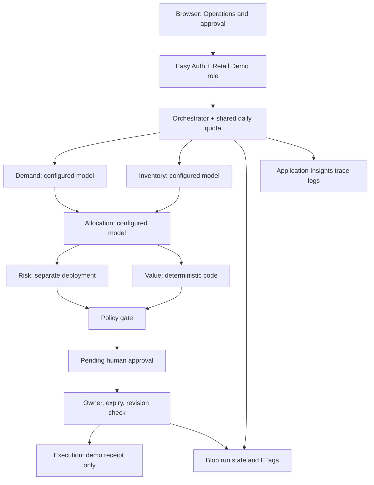

# Architecture

The implemented demo is one Node.js 22 Azure Functions v4 app serving public frontend assets and protected API routes. It orchestrates bounded specialist tasks, using either deterministic mock inference or managed-identity Azure model calls. It does not require a paid agent platform, vector database, Fabric, Agent 365, Purview or API Management. The proposed blueprint below records future architecture concepts.

`api/src/orchestrator.js` implements this dependency graph with `Promise.allSettled`. Independent tasks start before fan-in; all siblings settle before a failure is persisted so no late sibling mutates the final trace. Demand/inventory outputs feed allocation. Only numeric evidence flows between model agents; narratives are displayed as text and are not concatenated into downstream instructions. Risk and value follow allocation concurrently. Value applies fixture unit economics ($12 margin, $2 cost). A deterministic cap of 60 units and positive quantity supplements model risk review.

`contracts.d.ts` defines internal task envelopes, outputs, trace records and workflow states. JSDoc types the actual task construction; runtime checks validate each model output's exact fields, types, bounds and allocation evidence. Deployment names route by task type, never by browser input. Value and execution cannot be routed to a model. The older `agents/` contract remains a separately tested legacy example. Neither contract implements official A2A discovery, wire messages, streaming or protocol lifecycle semantics; no compliance claim is made.

## State and approval

`running → pending | blocked | failed`; `pending → rejected | executing → completed | failed`. Approval expires 30 minutes after run creation. The owner must be an Entra user with the demo role (or the explicit simulated identity in the loopback-only local server). Approval includes decision, actor and timestamp; the proposal is immutable after creation. Its revision is bound to approval. Azure Blob ETags provide compare-and-swap across instances. The winning approval claims `executing` before any execution task starts. No automatically retried enterprise action exists.

Deployed state is Blob JSON, retained for seven days. The local store preserves the same revision semantics in memory. UTC daily admission counters share that store and consume a slot before inference, including failed runs. Restarting a deployed app does not reset quota or approvals. Local restart resets both. Owner checks occur before reads and writes.

Execution only constructs a receipt and persists it. A host crash after claiming execution leaves an `executing` record; it does not automatically repeat the action. A host crash during analysis leaves `running`. Manual investigation is required; this short synchronous workflow is not a durable workflow engine. Clients losing the initial HTTP response cannot currently recover the generated run ID automatically.

## Reliability, telemetry and authentication

Each model call gets an internal task ID, workflow correlation ID, deadline, abort signal, deployment name and attempt. Timeouts, HTTP 429 and 5xx retry once, with bounded backoff; invalid output, authorization and policy errors fail closed. Timed-out remote inference might still incur charges. Overall Functions timeout is two minutes. There is no live-to-mock fallback. Trace snapshots persist at final analysis/approval state, and events also go to invocation logs. Application Insights sampling can drop log copies; Blob state is the demo review record, not an immutable compliance archive.

Easy Auth validates deployed bearer tokens and strips/splices trusted principal headers. The application checks AAD identity, object ID, delegated `access_as_user` scope and `Retail.Demo`. Do not host its deployed adapter behind a proxy that forwards user-controlled principal headers without authenticating them. Same-origin JSON requests, content limits and role/owner checks protect approval. ManagedIdentityCredential obtains Azure OpenAI and Blob tokens. Managed identity has Blob Data Owner on the host storage account and OpenAI User on the configured existing AI account; it has no retail system permissions.

The Functions app hosts frontend assets on the same origin, reusing CSP/security headers. A password input accepts a delegated API token for this operator demo; production should use an audited MSAL sign-in flow. UI business metrics remain illustrative and are labeled accordingly.

Sources: [Functions deployment configuration](https://learn.microsoft.com/en-us/azure/azure-functions/functions-infrastructure-as-code), [identity-based storage](https://learn.microsoft.com/en-us/azure/azure-functions/functions-identity-based-connections-tutorial), [keyless Azure model access](https://learn.microsoft.com/en-us/azure/developer/ai/keyless-connections), [Easy Auth](https://learn.microsoft.com/en-gb/azure/app-service/overview-authentication-authorization).

## Illustrative operating models

These former UI comparisons are proposals, not measured benchmarks or runtime permissions. Every demo execution still requires human approval. Legacy process timings and simulated outcomes below do not describe actual API execution.

### Inventory disruption

| Model | Cycle | Human effort | Cost/case | Risk | Proposed autonomy | Description |
| --- | --- | --- | --- | --- | --- | --- |
| Conservative: Planner-led response (Lowest disruption) | 9.6 hours | 12 actions | $34K | Low | 26% | Agents assemble signals and options. Planners approve every transfer and replenishment action. |
| Recommended: Agent-led rebalancing (Best value-to-risk) | 11 minutes | 1 approval | $8K | Controlled | 72% | Agents simulate and execute within policy. Material margin or supplier impacts require accountable approval. |
| Frontier: Continuous autonomous flow (Maximum velocity) | 3 minutes | Exceptions | $4K | Elevated | 93% | Agents continuously rebalance inventory and fulfillment, escalating only novel or high-impact decisions. |

Legacy process proposal:

- Detect demand shift: Demand Signal Agent; system; Real time.
- Build inventory graph: Inventory Agent; system; 42 sec.
- Simulate allocations: Allocation Agent; system; 2.4 min.
- Challenge plan: Risk Agent; system; 38 sec; control gap flagged.
- Approve transfer: Regional operator; human; 6 min.
- Execute and monitor: Execution Agent; system; Continuous.

Legacy simulated scenario narrative (not actual execution):

- Demand Signal · Demand spike detected for SKU-482 across Northeast digital channels · agent · forecast-model · Legacy internal task fixture.
- Inventory Agent · Store, DC, in-transit, and safety-stock positions reconciled · agent · fast-model + tools · Legacy internal result fixture.
- Allocation Agent · Six transfer plans simulated against margin and SLA · agent · reasoning-model · Candidate plan proposed.
- Risk & Governance · Plan challenged for weather, labor, and minimum-stock constraints · agent · independent-judge · Control opinion returned.
- Regional operator · High-value interstate transfer approved · human · deterministic-policy · Approval gate satisfied.
- Execution Agent · Transfers issued; fulfillment promises and telemetry updated · agent · policy-bound-tools · Workflow completed.

### Promotion event optimization

| Model | Cycle | Human effort | Cost/case | Risk | Proposed autonomy | Description |
| --- | --- | --- | --- | --- | --- | --- |
| Conservative: Merchandiser-led planning (Lowest disruption) | 2.4 days | 16 actions | $76K | Low | 24% | Agents prepare forecasts and recommendations while merchandising retains every decision. |
| Recommended: Agent-coordinated event (Best value-to-risk) | 18 minutes | 2 approvals | $19K | Controlled | 69% | Agents coordinate demand, supply, pricing, and fulfillment within approved commercial guardrails. |
| Frontier: Adaptive promotion network (Maximum velocity) | 5 minutes | Exceptions | $9K | Elevated | 91% | Agents continuously tune offers and allocation using observed demand and margin performance. |

Legacy process proposal:

- Ingest promotion: Merchandising systems; system; Real time.
- Forecast response: Demand Signal Agent; system; 1.8 min.
- Stress-test supply: Inventory Agent; system; 52 sec.
- Optimize offer: Allocation Agent; system; 2.1 min; control gap flagged.
- Approve guardrails: Merchandising lead; human; 4 min.
- Launch and adapt: Execution Agent; system; Continuous.

Legacy simulated scenario narrative (not actual execution):

- Demand Signal · Promotion response forecast generated by SKU, store, and channel · agent · forecast-model · Legacy internal task fixture.
- Inventory Agent · Constrained supply and substitution graph assembled · agent · fast-model + tools · Legacy internal result fixture.
- Allocation Agent · Price, placement, and fulfillment options optimized · agent · reasoning-model · Candidate plan proposed.
- Risk & Governance · Consumer fairness and margin guardrails evaluated · agent · independent-judge · Control opinion returned.
- Merchandising lead · Regional pricing exception approved · human · deterministic-policy · Approval gate satisfied.
- Execution Agent · Offer launched with continuous demand adaptation · agent · policy-bound-tools · Workflow completed.

## Proposed enterprise context and data flows

Everything in this section is a **target design**, not an implemented connector or deployed service. Today both mock and Azure providers use synthetic scenario evidence from `api/src/providers.js`; `data.js` contains illustrative dashboard content. No POS, ERP, OMS, WMS, retrieval index or retail write integration exists.

The target application boundary keeps the operations workspace responsible for review, the orchestrator responsible for workflow/policy, source applications authoritative for retail facts and transactions, and an analytics layer responsible for outcome measurement. Agents interpret bounded evidence and propose actions; they do not become systems of record or authorization services.

| Proposed source / accountable domain | Evidence and integration pattern | Proposed controls and consumers |
| --- | --- | --- |
| POS and ecommerce / sales operations | Sales, returns and channel demand by SKU/location/time; approved event feed or scheduled incremental extract | Reconcile totals, deduplicate event IDs, handle late arrivals; aggregate away customer identifiers. Demand agent consumes validated summaries |
| OMS / fulfillment | Orders, reservations, cancellations and service promises; read APIs plus order-state events | Distinguish on-hand from available-to-promise, apply source versions and freshness limits; demand/inventory agents read, allocation uses constraints |
| WMS and ERP / supply chain | Store/DC stock, safety stock, in-transit quantities, purchase orders and transfer status; scoped read APIs or change feeds | Reconcile SKU/location/unit semantics and snapshots; inventory owner sets staleness threshold; quarantine inconsistent balances |
| Merchandising/PIM and finance / commercial | Product hierarchy, promotion calendar, prices, margin and approved cost rates; versioned extracts or APIs | Effective dates and currency/unit validation; deterministic value service computes economics from approved rates, not model-generated amounts |
| Supplier/transport systems / logistics | Lead times, capacity, shipment events and freight estimates; partner APIs/events | Contracted data access, source trust and freshness checks; allocation/risk evaluate feasible movements |
| Policy repository / risk and operations | Transfer limits, approval authority, safety-stock and regional rules; curated, versioned documents and structured rules | Retrieval supplies authorized citations; deterministic rules enforce authority. Text instructions cannot grant tool permissions |
| ERP/WMS/OMS transaction APIs / application owners | Future transfer requests and fulfillment updates through a governed adapter | Separate write scope; revalidate current state, approval and policy; target-supported idempotency, reconciliation and compensation before any real action |

Use agreed contracts with SKU/location keys, units/currency, event time, source version, provenance, classification and freshness limits. Source owners certify quality; missing, stale or contradictory mandatory evidence blocks recommendation/action or routes to manual review. Treat ingestion payloads and retrieved text as untrusted data. Separate operational evidence snapshots from analytical history and audit records, with approved residency, retention/deletion and access policies. Do not copy customer-level data into prompts unless a separately reviewed use case requires it.

An integration layer would normalize reads and handle schema changes, retries, dead-letter processing and replay. Select existing enterprise messaging/API capabilities first; a new gateway, event bus or analytics platform needs a decision and cost justification. Index retrieval is suitable for policy explanation, not an authoritative check of current inventory. Immediately before a write, recheck reservations and stock in the owning system to prevent stale approvals from causing unsafe transfers.

## Production path to Microsoft Foundry, retrieval and governed tools

1. **Qualify model deployments.** Start at the existing `AzureProvider` seam with compatible Azure OpenAI deployments managed through Microsoft Foundry. The code sends `chat/completions` requests to an approved `/openai/v1/` endpoint with managed identity, JSON output and bounded completion parameters. Validate actual model/API compatibility, region/residency, quota, identity and live failure behavior in an authorized environment. Microsoft documents the v1 endpoint separately from project/agent APIs in its [model endpoint guidance](https://learn.microsoft.com/en-us/azure/ai-studio/ai-services/concepts/endpoints). Current tests use injected transport; no live Foundry validation or deployment is claimed.
2. **Add verified grounding.** Build approved source-read adapters first. For policy documents, evaluate Azure AI Search or an existing enterprise retrieval service; ingest only curated versions with source IDs, effective dates and access metadata. Enforce caller/team authorization at retrieval time, preserve citation and policy-version evidence, and test leakage, stale content, citation accuracy and prompt injection. Search supports application-managed security filters; choose and validate the appropriate access design using [Azure AI Search security guidance](https://learn.microsoft.com/en-us/azure/search/search-security-best-practices). Retrieval and its permission checks are not implemented here.
3. **Introduce governed tools.** Register narrowly scoped, typed operations in a server-controlled allowlist. Bind each request to user authority and a workload identity; validate arguments, data classification, current source state and approved proposal revision outside the model. Begin with reads. Writes need operation-specific permission, approval thresholds/separation of duties, durable workflow, target idempotency, reconciliation, compensation and tamper-evident outcome audit. Tool schemas or a gateway alone do not establish these controls.
4. **Qualify managed agent services only if needed.** Assess Foundry project/Agent Service capabilities against durable orchestration, tool governance, observability, data boundaries and cost requirements. Adopting them requires a new adapter/lifecycle design and evaluations; configuring a model endpoint does not implement that platform. Keep deterministic policy, value and authorization outside model discretion. Version model/prompt/retrieval configuration and require regression/safety checks, canary observation and rollback for changes.

No Foundry project API, Agent Service, retrieval, tool catalog or external transaction adapter is currently implemented. Internal `retail-task/2` messages remain an application contract, **not official A2A**. Any future interoperability claim requires implementation and validation against a selected official specification; none has been performed. Foundry IQ, Fabric, Agent 365 and Purview are optional candidates from the earlier blueprint, not runtime dependencies or committed platform choices.

## Governance and operating views

The current deployment view is a single Functions application, Blob state, model endpoint and monitoring boundary. The target adds durable workflow, source/read and transaction/write boundaries, authorization-aware retrieval and an audit archive only as their phase gates justify them. A service owner must define SLOs, recovery objectives, incident escalation, capacity and cost controls, model-change evaluation, deployment rollback and support handover. Production risk review must include data rights, access isolation, model error, stale evidence, duplicate external effects and incomplete execution recovery.

The [decision log](decision-log.md) is the authoritative rationale/alternatives record. [Requirements traceability](requirements-traceability.md) maps stakeholder concerns to components, tests, risks and outcomes. The [delivery roadmap](delivery-roadmap.md) defines stakeholders, pilot governance, adoption, sequencing and acceptance gates, replacing the former abbreviated 90-day sketch. Proposed autonomy percentages above never expand current permissions. See [production readiness](production-readiness.md), [threat model](threat-model.md) and [cost guidance](cost-guidance.md) for controls and remaining limitations.
