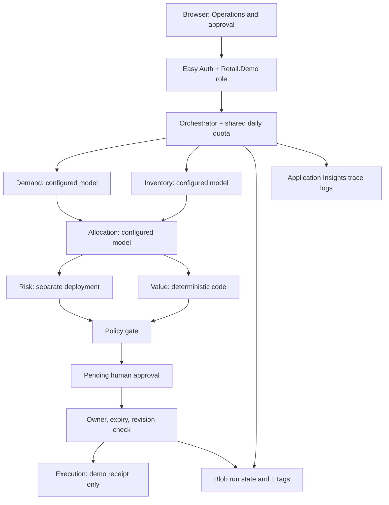

# Architecture

The implemented demo is one Node.js 22 Azure Functions v4 app serving public frontend assets and protected API routes. It orchestrates bounded specialist tasks, using either deterministic mock inference or managed-identity Azure model calls. It does not require a paid agent platform, vector database, Fabric, Agent 365, Purview or API Management. The proposed blueprint below records future architecture concepts.

`api/src/orchestrator.js` implements this dependency graph with `Promise.allSettled`. Independent tasks start before fan-in; all siblings settle before a failure is persisted so no late sibling mutates the final trace. Demand/inventory outputs feed allocation. Only numeric evidence flows between model agents; narratives are displayed as text and are not concatenated into downstream instructions. Risk and value follow allocation concurrently. Value applies fixture unit economics ($12 margin, $2 cost). A deterministic cap of 60 units and positive quantity supplements model risk review.

`contracts.d.ts` defines internal task envelopes, outputs, trace records and workflow states. JSDoc types the actual task construction; runtime checks validate each model output's exact fields, types, bounds and allocation evidence. Deployment names route by task type, never by browser input. Value and execution cannot be routed to a model. The older `agents/` contract remains a separately tested legacy example. Neither contract implements official A2A discovery, wire messages, streaming or protocol lifecycle semantics; no compliance claim is made.

## State and approval

`running → pending | blocked | failed`; `pending → rejected | executing → completed | failed`. Approval expires 30 minutes after run creation. The owner must be an Entra user with the demo role (or the explicit simulated identity in the loopback-only local server). Approval includes decision, actor and timestamp; the proposal is immutable after creation. Its revision is bound to approval. Azure Blob ETags provide compare-and-swap across instances. The winning approval claims `executing` before any execution task starts. No automatically retried enterprise action exists.

Deployed state is Blob JSON, retained for seven days. The local store preserves the same revision semantics in memory. UTC daily admission counters share that store and consume a slot before inference, including failed runs. Restarting a deployed app does not reset quota or approvals. Local restart resets both. Owner checks occur before reads and writes.

Execution only constructs a receipt and persists it. A host crash after claiming execution leaves an `executing` record; it does not automatically repeat the action. A host crash during analysis leaves `running`. Manual investigation is required; this short synchronous workflow is not a durable workflow engine. Clients losing the initial HTTP response cannot currently recover the generated run ID automatically.

## Reliability, telemetry and authentication

Each model call gets an internal task ID, workflow correlation ID, deadline, abort signal, deployment name and attempt. Timeouts, HTTP 429 and 5xx retry once, with bounded backoff; invalid output, authorization and policy errors fail closed. Timed-out remote inference might still incur charges. Overall Functions timeout is two minutes. There is no live-to-mock fallback. Trace snapshots persist at final analysis/approval state, and events also go to invocation logs. Application Insights sampling can drop log copies; Blob state is the demo review record, not an immutable compliance archive.

Easy Auth validates deployed bearer tokens and strips/splices trusted principal headers. The application checks AAD identity, object ID, delegated `access_as_user` scope and `Retail.Demo`. Do not host its deployed adapter behind a proxy that forwards user-controlled principal headers without authenticating them. Same-origin JSON requests, content limits and role/owner checks protect approval. ManagedIdentityCredential obtains Azure OpenAI and Blob tokens. Managed identity has Blob Data Owner on the host storage account and OpenAI User on the configured existing AI account; it has no retail system permissions.

The Functions app hosts frontend assets on the same origin, reusing CSP/security headers. A password input accepts a delegated API token for this operator demo; production should use an audited MSAL sign-in flow. UI business metrics remain illustrative and are labeled accordingly.

Sources: [Functions deployment configuration](https://learn.microsoft.com/en-us/azure/azure-functions/functions-infrastructure-as-code), [identity-based storage](https://learn.microsoft.com/en-us/azure/azure-functions/functions-identity-based-connections-tutorial), [keyless Azure model access](https://learn.microsoft.com/en-us/azure/developer/ai/keyless-connections), [Easy Auth](https://learn.microsoft.com/en-gb/azure/app-service/overview-authentication-authorization).

## Illustrative operating models

These former UI comparisons are proposals, not measured benchmarks or runtime permissions. Every demo execution still requires human approval. Legacy process timings and simulated outcomes below do not describe actual API execution.

### Inventory disruption

| Model | Cycle | Human effort | Cost/case | Risk | Proposed autonomy | Description |
| --- | --- | --- | --- | --- | --- | --- |
| Conservative: Planner-led response (Lowest disruption) | 9.6 hours | 12 actions | $34K | Low | 26% | Agents assemble signals and options. Planners approve every transfer and replenishment action. |
| Recommended: Agent-led rebalancing (Best value-to-risk) | 11 minutes | 1 approval | $8K | Controlled | 72% | Agents simulate and execute within policy. Material margin or supplier impacts require accountable approval. |
| Frontier: Continuous autonomous flow (Maximum velocity) | 3 minutes | Exceptions | $4K | Elevated | 93% | Agents continuously rebalance inventory and fulfillment, escalating only novel or high-impact decisions. |

Legacy process proposal:

- Detect demand shift: Demand Signal Agent; system; Real time.
- Build inventory graph: Inventory Agent; system; 42 sec.
- Simulate allocations: Allocation Agent; system; 2.4 min.
- Challenge plan: Risk Agent; system; 38 sec; control gap flagged.
- Approve transfer: Regional operator; human; 6 min.
- Execute and monitor: Execution Agent; system; Continuous.

Legacy simulated scenario narrative (not actual execution):

- Demand Signal · Demand spike detected for SKU-482 across Northeast digital channels · agent · forecast-model · Legacy internal task fixture.
- Inventory Agent · Store, DC, in-transit, and safety-stock positions reconciled · agent · fast-model + tools · Legacy internal result fixture.
- Allocation Agent · Six transfer plans simulated against margin and SLA · agent · reasoning-model · Candidate plan proposed.
- Risk & Governance · Plan challenged for weather, labor, and minimum-stock constraints · agent · independent-judge · Control opinion returned.
- Regional operator · High-value interstate transfer approved · human · deterministic-policy · Approval gate satisfied.
- Execution Agent · Transfers issued; fulfillment promises and telemetry updated · agent · policy-bound-tools · Workflow completed.

### Promotion event optimization

| Model | Cycle | Human effort | Cost/case | Risk | Proposed autonomy | Description |
| --- | --- | --- | --- | --- | --- | --- |
| Conservative: Merchandiser-led planning (Lowest disruption) | 2.4 days | 16 actions | $76K | Low | 24% | Agents prepare forecasts and recommendations while merchandising retains every decision. |
| Recommended: Agent-coordinated event (Best value-to-risk) | 18 minutes | 2 approvals | $19K | Controlled | 69% | Agents coordinate demand, supply, pricing, and fulfillment within approved commercial guardrails. |
| Frontier: Adaptive promotion network (Maximum velocity) | 5 minutes | Exceptions | $9K | Elevated | 91% | Agents continuously tune offers and allocation using observed demand and margin performance. |

Legacy process proposal:

- Ingest promotion: Merchandising systems; system; Real time.
- Forecast response: Demand Signal Agent; system; 1.8 min.
- Stress-test supply: Inventory Agent; system; 52 sec.
- Optimize offer: Allocation Agent; system; 2.1 min; control gap flagged.
- Approve guardrails: Merchandising lead; human; 4 min.
- Launch and adapt: Execution Agent; system; Continuous.

Legacy simulated scenario narrative (not actual execution):

- Demand Signal · Promotion response forecast generated by SKU, store, and channel · agent · forecast-model · Legacy internal task fixture.
- Inventory Agent · Constrained supply and substitution graph assembled · agent · fast-model + tools · Legacy internal result fixture.
- Allocation Agent · Price, placement, and fulfillment options optimized · agent · reasoning-model · Candidate plan proposed.
- Risk & Governance · Consumer fairness and margin guardrails evaluated · agent · independent-judge · Control opinion returned.
- Merchandising lead · Regional pricing exception approved · human · deterministic-policy · Approval gate satisfied.
- Execution Agent · Offer launched with continuous demand adaptation · agent · policy-bound-tools · Workflow completed.

## Proposed blueprint and decision record

The Operations UI links here for technical detail. Server-configured routing is available through `GET /api/config`; run responses contain trace snapshots with deployment, attempts and latency. The browser presents business results and approval status.

| Layer | Proposed components |
| --- | --- |
| Experience | Operations workspace, approvals, value dashboard |
| Agent | Process orchestrator, evidence agent, risk agent |
| Knowledge | Foundry IQ, Microsoft Fabric, policy graph |
| Control | Microsoft Entra ID, Agent 365, Purview |
| Operations | Azure Monitor, evaluation pipeline, Cost Management |

The proposed control boundary calls for identity-bound tool calls, evidence attached to decisions, approval for material exceptions, model and workflow evaluations, and end-to-end activity audit. “Least agency” means minimum delegated authority. Proposed autonomy percentages never expand current permissions.

- ADR-01: Use agent-led orchestration with human approval to reduce queue time while preserving accountability for material exceptions.
- ADR-02: Separate evidence assembly from decision authority so automation does not silently expand agent permissions.
- ADR-03: Ground recommendations in versioned policy for reproducibility, audit and controlled evolution.
- ADR-04: Measure business outcomes alongside model quality to detect poor adoption or process value.

These are proposed design decisions, not evidence of production acceptance.

| Requirement | Proposed response | Illustrative acceptance target |
| --- | --- | --- |
| R-01: Reduce cycle time | Process orchestrator and parallel evidence | Median completion ≤ 3.5 days |
| C-02: Human accountability | Risk gate and signed approval | 100% material exceptions approved |
| C-04: Explain decisions | Citation and policy-version capture | ≥ 98% evidence completeness |
| R-07: Control unit economics | Model routing and token budgets | AI cost ≤ $2.50 per completed case |

Proposed 90-day roadmap: days 0–30 establish baselines, curate policies, test offline evaluations and validate approval boundaries; days 31–60 pilot with one operating team, capture adoption and exception telemetry and tune controls; days 61–90 complete production review, integrate systems of record and establish value measurement.

Production actions require scoped adapters, verified evidence, versioned policies, operation-specific permissions, idempotency, reconciliation and compensation. Pilots also require sign-in, durable orchestration, tenant isolation, audit, evaluations and prompt-injection testing. Model rationale remains unverified; separate risk models do not guarantee independence. Budgets notify rather than enforce spend. No official A2A conformance testing has been performed. See [production readiness](production-readiness.md), [threat model](threat-model.md) and [cost guidance](cost-guidance.md).
